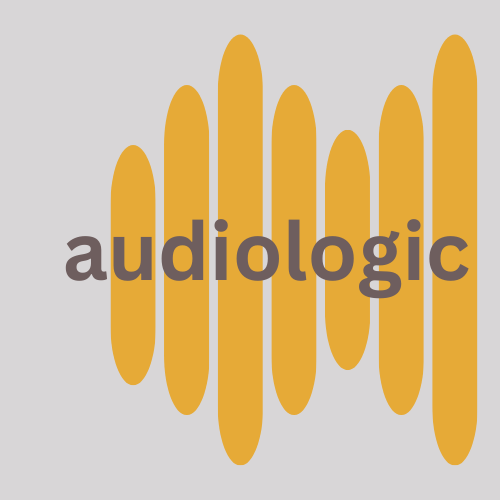

# audiologic

----

Python Module to process and predict on music attributes

PROJECT IN ACTIVE DEVELOPMENT

### Data Used:
- 1000 Song Dataset - [Download here](https://cvml.unige.ch/databases/emoMusic/)
- Spotify Developer API - [30 second previews](https://developer.spotify.com/documentation/web-api/)

## Package Requirements
`pip install -r requirements.txt`
- make sure to download whisper from openai (not currently included in requirements.txt)
- Also must install ffmpeg (using brew, choco, etc.)
