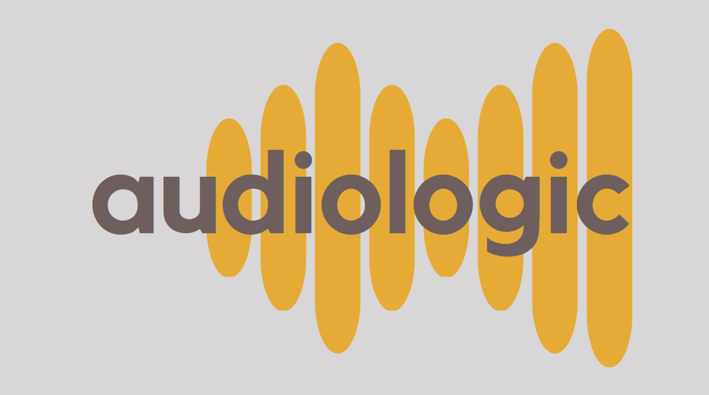

----

Python Module to process and predict on music attributes

----

Two Models were built and trained to predict valence given an audio sample. One uses a feature pipeline on top of librosa to make a number of predictors that go into a Random Forest model to determine a valence prediction. The other uses OpenAI's whisper model to transcribe lyrics, then tokenize the words, and again a trained Random Forest model makes the prediction based on lyrics.

|        | Model RMSE |
|--------|------------|
| Audio  | 1.56       |
| Lyrics | 1.28       |

### Data Used:
- 1000 Song Dataset - [Download here](https://cvml.unige.ch/databases/emoMusic/)
- Spotify Developer API - [30 second previews](https://developer.spotify.com/documentation/web-api/)

## Package Requirements
`pip install -r requirements.txt`
- make sure to download [whisper from openai](https://github.com/openai/whisper) (not currently included in requirements.txt)
- Also must install ffmpeg (using brew, choco, etc.)
